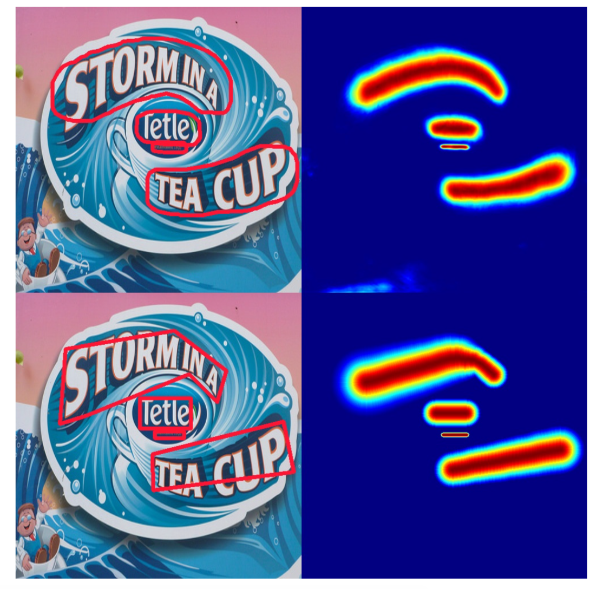

# SA-Text: Simple but Accurate Detector for Text of Arbitrary Shapes

## Requirements
* Python 2.7
* PyTorch v0.4.1+
* pyclipper
* Polygon2
* opencv-python 3.4
* TVM-0.7dev(Optional)

## Introduction

Regression with gaussian map to detect text accurate.


### training

```shell
python train_ic15.py --arch resnet50 --batch_size 4 --root_dir $data_root_dir  
```

### testing

```shell
python eval_sanet.py --root_dir $data_root_dir  --resume checkpoints/ic15_resnet50_bs_4_ep_xxx/checkpoint.pth.tar  --gpus 1
```

### visualization

Training_data: MTWI dataset

|                                                              |                                                        |                                                        |
| ------------------------------------------------------------ | :----------------------------------------------------: | ------------------------------------------------------ |
| |  |  |


### TVM Optimized Graph
Here is example of TVM-optimized graph in `tvm_optimize`, we use tvm to optimize onnx-format model

#### Generate onnx model

```
python eval_sanet.py --root_dir $data_root_dir  --resume checkpoints/ic15_resnet50_bs_4_ep_xxx/checkpoint.pth.tar  --gpus 1 --onnx 1
```

#### Optimize with onnx-format model
Here onnx opset is opset-9, some error will be raised, you can fix it as follows in file `python/tvm/relay/frontend/onnx.py`:

For Upsample, `scales` is not in attr, here I add scales into `except`
```python
class Upsample(OnnxOpConverter):
    """ Operator converter for Upsample (nearest mode).
    """

    @classmethod
    def _impl_v9(cls, inputs, attr, params):
        scales = attr.get('scales')
        
        if not scales:
            #Here we are going to higher OPSET version.
            assert len(inputs) == 2, "Upsample op take 2 inputs, {} given".format(len(inputs))
            
            try:
                scales = params[inputs[1].name_hint].asnumpy()
            except:
                scales = [1., 1., 2., 2.]
            inputs = inputs[:1]
        assert len(scales) == 4 and scales[0] == 1.0 and scales[1] == 1.0
        mode = attr.get('mode')
        if mode == b'nearest':
            method = "nearest_neighbor"
        elif mode == b'linear':
            method = "bilinear"
        else:
            raise tvm.error.OpAttributeInvalid(
                'Value {} in attribute "mode" of operator Upsample is not valid.'.format(mode))
        attr = {'scale_h': scales[-2], 'scale_w': scales[-1], 'method': method,
                'layout': 'NCHW', 'align_corners': True}
        return AttrCvt('upsampling')(inputs, attr)

```

For Slice, `ends` and `starts` are not in inputs and in attr, so we add them into except by getting from attrs
```python

class Slice(OnnxOpConverter):
    """ Operator converter for Slice.
    """

    @classmethod
    def _common(cls, starts, ends, axes):
        new_axes = []
        new_starts = []
        new_ends = []
        pop_index = 0
        for i in range(max(axes) + 1):
            if i in axes:
                new_axes.append(i)
                new_starts.append(starts[pop_index])
                new_ends.append(ends[pop_index])
                pop_index += 1
            else:
                new_axes.append(i)
                new_starts.append(0)
                new_ends.append(np.iinfo(np.int32).max)
        return new_starts, new_ends, new_axes

    @classmethod
    def _impl_v1(cls, inputs, attr, params):
        if isinstance(attr['starts'], int):
            attr['starts'] = (attr['starts'],)
            attr['ends'] = (attr['ends'],)

        try:
            # Update the starts and ends according to axes if required.
            if isinstance(attr['axes'], int):
                attr['axes'] = (attr['axes'],)
            if (max(attr['axes']) + 1) != len(attr['axes']):
                new_starts, new_ends, new_axes = cls._common(
                    attr['starts'], attr['ends'], attr['axes'])
                attr['axes'] = new_axes
                attr['starts'] = new_starts
                attr['ends'] = new_ends
        except KeyError:
            pass

        return AttrCvt('strided_slice',
                       transforms={'starts': 'begin',
                                   'ends': 'end'},
                       ignores=['axes'])(inputs, attr)

    @classmethod
    def _impl_v10(cls, inputs, attr, params):
        try:
            starts = params[get_name(inputs[1])].asnumpy()
            ends = params[get_name(inputs[2])].asnumpy()
        except:
            starts = attr['starts']
            ends = attr['ends']
        # Update the starts and ends according to axes if required.
        if len(inputs) >= 4:
            try:
                axes = params[get_name(inputs[3])].asnumpy()
            except:
                axes = attr['axes']
            if max(axes + 1) != len(axes):
                new_starts, new_ends, _ = cls._common(
                    starts, ends, axes)
                starts = new_starts
                ends = new_ends
        return _op.strided_slice(inputs[0], begin=starts, end=ends)
```

#### TVM-Optimize
Before optimize graph, here need to star rpc server for autotvm by following commands:
```shell

 python -m tvm.exec.rpc_tracker --host=0.0.0.0 --port=9190 
 
 # start new terminal window
 CUDA_VISIBLE_DEVICES=1 python -m tvm.exec.rpc_server --tracker=0.0.0.0:9190 --key=p100
```
More deitals about autotvm, you can find documents about it [**Auto-tuning a convolutional network for NVIDIA GPU**](https://docs.tvm.ai/tutorials/autotvm/tune_relay_cuda.html)
```python
# you can set different target for graph
python tvm_optimize/tvm_optimize_graph.py
```

```python
# Inference testing
python tvm_optimize/optimized_graph_inference.py
```

#### TensorRT-Optimize
Here are three steps to optimize graph by tensorrt:
- onnx-simplifier[https://github.com/daquexian/onnx-simplifier]: Simplify onnx model
- Generate engine 
- TensorRT(7.0) Python-API for inferencc

Simplify onnx model:
```
pip3 install onnx-simplifier
python -m onnxsim textdetection_satext.onnx textdetection_satext_sim.onnx --input-shape 1,3,1024,1024
```
Generate engine for onnx model:
```
python onnx_engine.py textdetection_satext_sim.onnx textdetection_satext.plan
```
Inference with engine:
```
python inference_trt.py /home/gengjiajia/rsync/ICDAR/icpr_dataset/  textdetection_satext.plan
```
#### Inference time
Just for network inference time with shape(512x512), as following table shows:
|  | pytorch | tvm | Tensorrt-python-API |
| ---------- | ------------ | ----------- | --------- |
| network-inference | 20ms | 10ms | 13ms |


## Differences from original paper

Here are two differences from paper: postprogress algorithm and outputs of network.

here are two outputs of networks: border map and guassian map. **Border map** is used to separate from two text instances, and **gaussian map** is used to generate text center region. For afraid of two text center regions are attach, so we can use a border map to delete these pixels that are in two instances border; then we use text center region to generate text instances, finally, we expand text instances by dilating in opencv.

